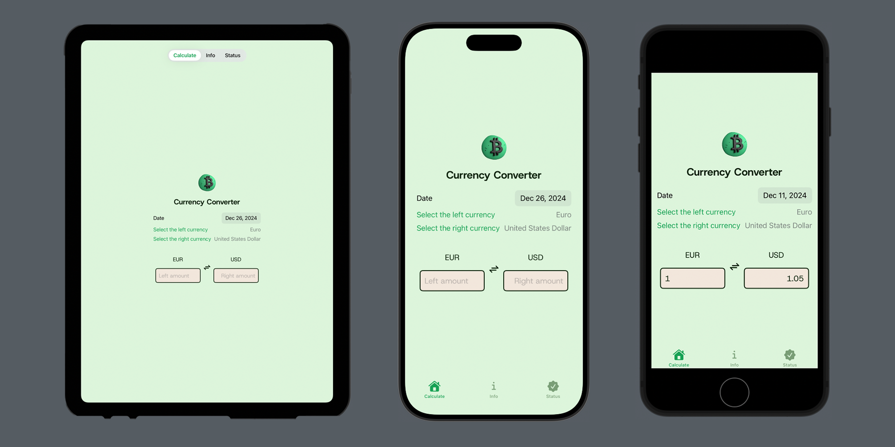
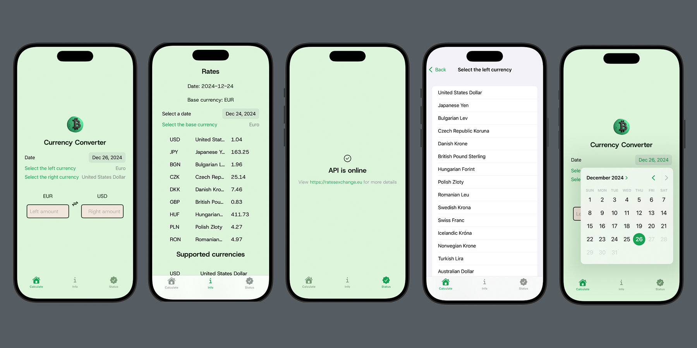
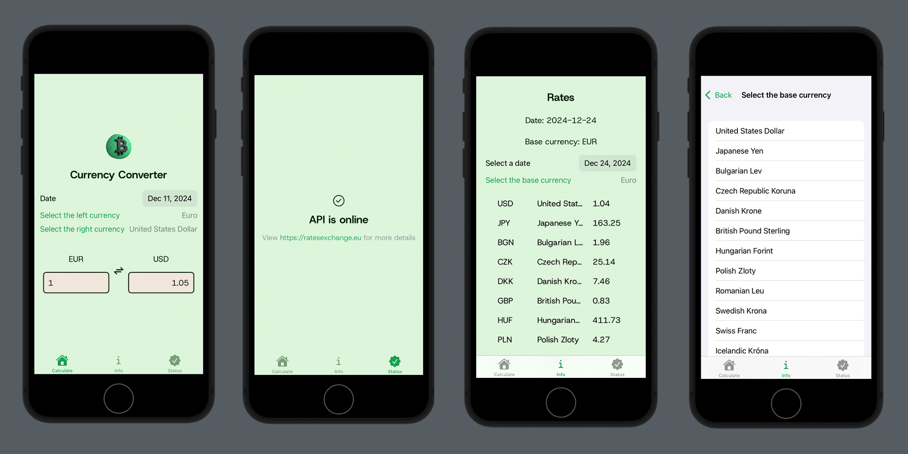

<div id="top"></div>

<!-- PROJECT LOGO -->
<br />
<div align="center">


<h3 align="center">Currency Converter</h3>

<p align="center">A SwiftUI Currency Converter App using RatesExchangeAPI</p>

  <p align="center">
    <br />
    <a href="https://github.com/LynnHaDo/Currency-Exchange-Converter/issues">Report Bug</a>
    ·
    <a href="https://github.com/LynnHaDo/Currency-Exchange-Converter/issues">Request Feature</a>
  </p>
</div>

<!-- TABLE OF CONTENTS -->
<details>
  <summary>Table of Contents</summary>
  <ol>
    <li>
      <a href="#demo">Demo</a>
    </li>
    <li>
      <a href="#about-the-project">About The Project</a>
      <ul>
        <li><a href="#features">Features</a></li>
        <li><a href="#built-with">Built With</a></li>
      </ul>
    </li>
    <li>
      <a href="#getting-started">Getting Started</a>
      <ul>
        <li><a href="#build-locally">Build Locally</a></li>
      </ul>
    </li>
    <li><a href="#contact">Contact</a></li>
  </ol>
</details>

<!-- UPDATES -->
## Demo

<div align="center">
  <video src="https://github.com/user-attachments/assets/071f37ce-5ec6-4242-99c2-77b252f2fac8"
         width="320">
</div>

### Screen layouts



<p align="center">Different formats</p>



<p align="center">iPhone 16 Pro</p>



<p align="center">iPhone SE</p>

<!-- ABOUT THE PROJECT -->
## About The Project

This is my first attempt at making a SwiftUI app! In an attempt to make this not a simple calculator app, I created a simple currency converter app that fetches currency data from the [Rates Exchange API](https://ratesexchange.eu/Docs), and rendered those to view. The endpoints I utilized throughout this project include: 

- `/client/checkapi`: Check API status
- `/client/historydetails`: Get detailed history rates
- `​/client​/convertdetails`: Convert currency details
- `/client/currencies`: Get available currencies

(No hard-coded calculations were made. All conversion results are supported by the APIs.)

<p align="right">(<a href="#top">back to top</a>)</p>

### Features

- [x] Convert an amount to and from 2 currencies by a specific date 
- [x] View all available currencies and rates by date 

<p align="right">(<a href="#top">back to top</a>)</p>

### Built With

- XCode 16.2
- [SwiftUI](https://developer.apple.com/xcode/swiftui/)
- [Rates Exchange API](https://ratesexchange.eu/)

<p align="right">(<a href="#top">back to top</a>)</p>

<!-- GETTING STARTED -->

## Getting Started

### Build locally 

1. Clone the repo

```
git clone https://github.com/LynnHaDo/Currency-Exchange-Converter.git
```

2. Sign up for an account at Rates Exchange

3. Copy the API Key 

4. In the `Config` directory, create a file to store the API key and configurations to fetch the data from the API. 

It should look something like:

```
//
//  Settings.swift
//  CurrencyConverter
//
//  Created by Do Linh on 12/22/24.
//

enum Secrets {
    static let ratesExchangeApiKey = "YOUR_API_KEY"
}

struct Routes {
    // Documentation: https://ratesexchange.eu/Docs
    static let baseUrl = "https://api.ratesexchange.eu/client"
    
    // Check API Status
    static let checkOnlineUrl = "\(baseUrl)/checkapi"
    // API Key param
    static let apiKeyParam = "?apiKey=\(Secrets.ratesExchangeApiKey)"
    // Get the rates from a past date
    static let historyDetailsUrl = "\(baseUrl)/historydetails\(apiKeyParam)"
    // Get the converted amount
    static let convertDetailsUrl = "\(baseUrl)/convertdetails\(apiKeyParam)"
    // Get the available currencies
    static let currenciesUrl = "\(baseUrl)/currencies\(apiKeyParam)"
}

```

If you can use another method to store the API key securely, please do so :) 

<p align="right">(<a href="#top">back to top</a>)</p>

<!-- Contact -->

## Contact

Email: <a href="mailto:do24l@mtholyoke.edu">do24l@mtholyoke.edu</a>
